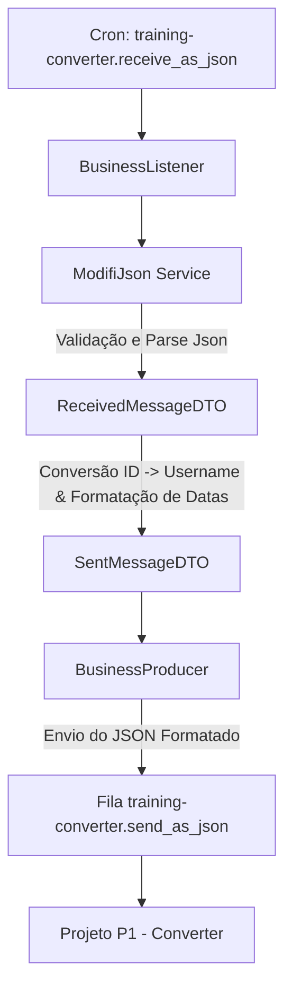
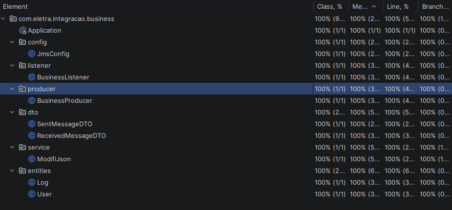
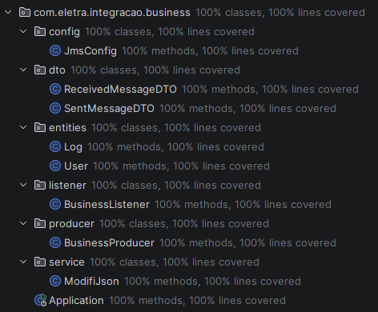

# Projeto de Integração AMI - P2: Alteração nas Regras de Negócio

## Visão Geral

Este projeto corresponde ao **Projeto 2 - Alteração nas Regras de Negócio** do treinamento de integração AMI.

O objetivo deste módulo é atuar como uma camada **BUSINESS** intermediária entre a geração original dos dados (cron) e o serviço **CONVERTER** (desenvolvido no Projeto 1).

A necessidade de criar este módulo surgiu de uma mudança na regra de negócio: o cliente decidiu que não deve mais ser salvo o "nome de usuário", mas sim o **ID do usuário**. Como o negócio antigo não poderia ser alterado, este novo projeto foi criado para receber a mensagem original, adaptar os dados (neste caso, mapeando o ID para o campo de usuário e formatando as datas) e repassar a nova mensagem na fila correspondente.

A aplicação foi desenvolvida com **Java 17**, **Spring Boot 3**, **Maven** e **Apache ActiveMQ Artemis**.

---

## Objetivo da Atividade

Implementar um novo serviço **BUSINESS** capaz de:

1. Ler mensagens no formato JSON da fila `training-converter.receive_as_json`;
2. Converter e formatar o conteúdo para a estrutura esperada pela CONVERTER do Projeto 1;
3. Substituir o envio do nome do usuário pelo ID;
4. Enviar a mensagem formatada para a fila `training-converter.send_as_json`;
5. Garantir 100% de cobertura de testes, utilizando **Testcontainers** para testes de integração com o ActiveMQ.

---

## Formato de Entrada

A aplicação espera receber dados na fila `training-converter.receive_as_json` com a estrutura abaixo, mapeada via `ReceivedMessageDTO`:

```json
{
  "user": {
    "id":"b16404b4-f690-44dc-8db0-8f48ec568590",
    "username":"francisco.parreira",
    "firstName":"Lorraine",
    "lastName":"Almeida",
    "employeeCode":"640708",
    "position":"gardener",
    "cpf":"534.670.770-05"
  },
  "log": {
    "id":"9580ab40-b0b6-42cb-bb8f-7c1e1f654f6a",
    "sentAt":"01-27-2026T12:05:04.001Z",
    "message":"No. Interestingly enough, her leaf blower picked up.",
    "format":null
  }
}
```

---

## Formato de Saída (Para o Converter - P1)

A mensagem formatada e enviada para a fila `training-converter.send_as_json` (consumida pelo P1) possui a seguinte estrutura, mapeada via `SentMessageDTO`:

```json
{
  "username": "id do (user)",
  "createdAt": "2026-03-23 13:59:00",
  "sentAt": "2026-03-17 14:00:00",
  "message": "Mensagem de teste"
}
```

---

## Regra de Conversão (Business Logic)

A classe `ModifiJson` é a responsável pela regra de negócio, efetuando as seguintes transformações:

- **ID do Usuário:** O valor de `user.id` da mensagem recebida é mapeado para o campo `username` na mensagem de saída.
- **Data de Envio (`sentAt`):** O formato original (ex: `03-17-2026T14:00:00.000Z`) é convertido para o padrão `yyyy-MM-dd HH:mm:ss` UTC.
- **Data de Criação (`createdAt`):** Gerada automaticamente no momento do processamento, no formato `yyyy-MM-dd HH:mm:ss` UTC.
- **Mensagem (`message`):** É repassada integralmente com base em `log.message`.

Além disso, a aplicação conta com validações estritas que garantem a presença e o preenchimento de todos os dados obrigatórios no Payload, lançando exceção caso alguma informação esteja ausente.

---

## Tecnologias Utilizadas

- **Java 17**
- **Spring Boot 3**
- **Maven**
- **Spring JMS**
- **Apache ActiveMQ Artemis**
- **Jackson Databind** (para manipulação de JSON)
- **JUnit 5** e **Testcontainers** (para testes de integração com banco/fila reais em container)
- **Lombok**
- **Log4j2**

---

## Estrutura do Projeto

```text
P2
├── src
│   ├── main
│   │   ├── java/com/eletra/integracao/business
│   │   │   ├── config
│   │   │   │   └── JmsConfig.java
│   │   │   ├── dto
│   │   │   │   ├── ReceivedMessageDTO.java
│   │   │   │   └── SentMessageDTO.java
│   │   │   ├── entities
│   │   │   │   ├── User.java
│   │   │   │   └── Log.java
│   │   │   ├── listener
│   │   │   │   └── BusinessListener.java
│   │   │   ├── producer
│   │   │   │   └── BusinessProducer.java
│   │   │   ├── service
│   │   │   │   └── ModifiJson.java
│   │   │   └── Application.java
│   │   └── resources
│   │       └── application.properties
│   └── test
│       ├── java/com/eletra/integracao/business
│           ├── integration
│           ├── listener
│           ├── service
│           ├── ApplicationTests.java
│           ├── TestApplication.java
│           └── TestcontainersConfiguration.java
├── pom.xml
└── README.md
```

---

## Fluxo da Aplicação



---

## Configuração da Aplicação

A aplicação (`application.properties`) está configurada para conectar a um broker Artemis local e expor as seguintes filas:

```properties
app.queues.input=training-converter.receive_as_json
app.queues.output=training-converter.send_as_json
```

---

## Como Executar o Projeto

### 1. Preparação

Certifique-se de que os containers do ambiente (ActiveMQ, etc) descritos no Projeto 0 estejam em execução.

### 2. Acessar o diretório do módulo P2

```bash
cd P2
```

### 3. Executar a aplicação

No Windows:

```bash
mvnw.cmd spring-boot:run
```

Ou com Maven instalado:

```bash
mvn spring-boot:run
```

A aplicação subirá e ficará aguardando mensagens na fila de entrada.

---

## Testes Automatizados e Testcontainers

O projeto demanda **100% de cobertura de testes**. Para garantir a resiliência e a corretude de toda a cadeia JMS, foram implementados testes que fazem uso nativo de **Testcontainers**.

Durante a execução dos testes, o Testcontainers levanta uma instância isolada do broker **ActiveMQ Artemis** dentro de um container Docker temporário. Isso garante que os testes não interferiram no ambiente local real e testem a comunicação real com a fila JMS.

### Como Executar os Testes

No Windows:

```bash
mvnw.cmd test
```

Ou com Maven instalado:

```bash
mvn test
```

Os testes validarão:
- O processamento correto do Payload;
- O mapeamento assertivo do ID do usuário para o campo username;
- A correta formatação dos campos de data;
- A rejeição de payloads inválidos por parte do serviço de validação.

---

## Cobertura de Testes (Coverage)

Para garantir a confiabilidade das transformações e a resiliência do sistema, o projeto foi desenvolvido buscando a cobertura total das classes de negócio. Abaixo, seguem os resultados obtidos através do plugin de Coverage do IntelliJ:

### Relatório Geral de Cobertura



*O relatório acima demonstra que 100% das linhas de código das camadas de Service, Listener e Producer foram validadas pelos testes de unidade e integração.*

### Detalhamento por Classe

* A seguinte imagem comprova 100% de cobertura de testes, em todas as classes do P2.



> **Nota:** A classe `Application` atinge cobertura através do teste de carregamento de contexto (`contextLoads`), garantindo que a infraestrutura do Spring Boot está operando corretamente.

---

## Conclusão

Com a implementação deste módulo **BUSINESS (P2)**, o pipeline de integração de dados da aplicação se completa:

`Cron` $\rightarrow$ `P2 Business` (trata a nova regra e formata o payload reatribuindo campo ID) $\rightarrow$ `P1 Converter` (Gera o CSV final).

Este módulo demonstrou uma abordagem robusta para resolver uma mudança de negócio de forma isolada, inserindo uma camada adaptadora intermediária sem quebrar os contratos legados existentes nem modificar aplicações de terceiros.

---

## Autor

Projeto desenvolvido para a atividade **Projeto 2 - Alteração nas regras de negócio** do treinamento de integração AMI.
