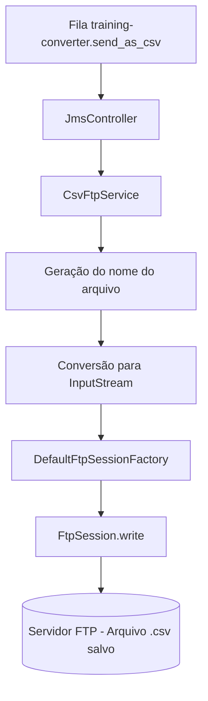

# Projeto de Integração AMI - P3: O Programador se Demitiu...

## Visão Geral

Este projeto corresponde ao **Projeto 3 - O Programador se Demitiu...** do treinamento de integração AMI.

O objetivo do módulo é consumir mensagens no formato **CSV** a partir de uma fila JMS e salvar o conteúdo recebido em um arquivo `.csv` dentro de um **servidor FTP embarcado na própria aplicação**.

A aplicação foi desenvolvida com **Java 17**, **Spring Boot**, **Maven**, **Apache ActiveMQ Artemis** e **Spring Integration FTP**, seguindo uma estrutura simples e modular para facilitar manutenção, leitura e testes.

---

## Objetivo da Atividade

Implementar um novo módulo **NETWORK-FTP** capaz de:

1. Escutar a fila `training-converter.send_as_csv`;
2. Receber o conteúdo CSV publicado pelo módulo **CONVERTER (P1)**;
3. Gerar um nome de arquivo único com base em timestamp e UUID;
4. Salvar o arquivo `.csv` recebido no **servidor FTP** provisionado pela própria aplicação.

---

## Formato de Entrada

A aplicação recebe mensagens de texto puro na fila `training-converter.send_as_csv` no seguinte formato:

```csv
user,time,message
"id123","2026-08-24 13:59:00","yipe hey, yipe ho... e uma garrafa de rum!"
```

---

## Formato do Arquivo Gerado

Cada mensagem recebida é salva no servidor FTP como um arquivo `.csv` com nome único gerado automaticamente:

```
data_20260407_121530123_a1b2c3d4.csv
```

O padrão de nomenclatura é: `data_` + `yyyyMMdd_HHmmssSSS` + `_` + `8 primeiros caracteres do UUID`.

---

## Tecnologias Utilizadas

- **Java 17**
- **Spring Boot 3.5.13**
- **Maven**
- **Spring JMS**
- **Apache ActiveMQ Artemis**
- **Spring Integration FTP**
- **Apache FTP Server** (ftpserver-core + ftplet-api)
- **Apache MINA**
- **Lombok**
- **JUnit 5**
- **Mockito**
- **Testcontainers** (ActiveMQ Artemis)
- **Log4j2**
- **Docker Compose**

---

## Estrutura do Projeto

```text
P3
├ src
│   ├ main
│   │   ├ java/com/eletra/integracao/networkftp
│   │   │   ├ config
│   │   │   │   └ FtpServerConfig.java
│   │   │   ├ controller
│   │   │   │   └ JmsController.java
│   │   │   ├ service
│   │   │   │   └ CsvFtpService.java
│   │   │   └ NetworkFtpApplication.java
│   │   └ resources
│   │   │   ├ log4j2.xml
│   │       └ application.properties
│   └ test
│       ├ java/com/eletra/integracao/networkftp
│       │   ├ config
│       │   │   ├ FtpServerConfigTest.java
│       │   │   └ TestcontainersConfiguration.java
│       │   ├ controller
│       │   │   └ JmsControllerTest.java
│       │   ├ service
│       │   │   └ CsvFtpServiceTest.java
│       │   ├ NetworkFtpApplicationTests.java
│       │   └ TestNetworkFtpApplication.java
│       └ resources
│           └ application.properties
├ compose.yaml
├ pom.xml
└ README.md
```

---

## Organização das Classes

### `NetworkFtpApplication`
Ponto de entrada da aplicação Spring Boot.

### `FtpServerConfig`
Responsável por provisionar o **servidor FTP embarcado** (Apache FTP Server) e a **sessão de cliente FTP** (`DefaultFtpSessionFactory`) utilizados pela aplicação.

- Cria e inicia um `FtpServer` na porta configurada;
- Registra um usuário FTP com permissão de escrita;
- Define o diretório raiz do servidor no `home` do usuário do sistema operacional;
- Configurado com `@Profile("!test")` para não conflitar com os testes.

### `JmsController`
Escuta a fila `training-converter.send_as_csv` via `@JmsListener` e delega o processamento para a `CsvFtpService`.

- Em caso de exceção, o erro é propagado para o Artemis, que mantém a mensagem na fila para nova tentativa.

### `CsvFtpService`
Responsável por:
- Gerar o nome único do arquivo (`data_<timestamp>_<uuid>.csv`);
- Converter o conteúdo CSV (`String`) em um `InputStream`;
- Abrir uma sessão FTP e realizar o upload do arquivo no servidor;
- Garantir o fechamento da sessão FTP via `try-with-resources`.

---

## Fluxo da Aplicação



---

## Configuração da Aplicação

A aplicação está configurada para consumir a fila do broker Artemis local e se conectar ao servidor FTP embarcado.

### Propriedades principais (`application.properties`)

```properties
spring.artemis.broker-url=tcp://localhost:61616
spring.artemis.user=admin
spring.artemis.password=admin

application.ftp.host=localhost
application.ftp.port=21
application.ftp.username=ftp_user
application.ftp.password=ftp_password
application.ftp.pasv_ports=50000-50100
application.ftp.listener=default
application.ftp.root_directory=ftp

spring.docker.compose.enabled=false
```

Todas as propriedades FTP suportam sobrescrita via **variáveis de ambiente**, facilitando a execução em diferentes ambientes.

---

## Como Executar o Projeto

### 1. Subir os containers do ambiente

Certifique-se de que os containers do ambiente (ActiveMQ, etc.) descritos no Projeto 0 estejam em execução.

```bash
docker compose up -d
```

### 2. Acessar o diretório do módulo P3

```bash
cd P3
```

### 3. Executar a aplicação

No Windows:

```bash
mvnw.cmd spring-boot:run
```

Ou com Maven instalado:

```bash
mvn spring-boot:run
```

A aplicação subirá, iniciará o servidor FTP embarcado e ficará aguardando mensagens na fila `training-converter.send_as_csv`.

---

## Comportamento Esperado

Quando uma mensagem CSV for publicada na fila `training-converter.send_as_csv` (pelo módulo **CONVERTER - P1**), a aplicação deverá:

1. receber a mensagem da fila;
2. gerar um nome de arquivo único baseado em timestamp e UUID;
3. converter o conteúdo para `InputStream`;
4. abrir uma sessão com o servidor FTP embarcado;
5. realizar o upload e salvar o arquivo `.csv`;
6. fechar a sessão FTP automaticamente.

Exemplo de log esperado no terminal:

```text
Mensagem recebida da fila. Iniciando processamento FTP...
Processo de envio para o arquivo data_20260407_121530123_a1b2c3d4.csv iniciado.
Upload concluído: data_20260407_121530123_a1b2c3d4.csv
Processamento finalizado com sucesso para a mensagem atual.
```

---

## Testes Implementados

### `NetworkFtpApplicationTests`
Valida o carregamento completo do contexto da aplicação com o profile de teste ativo.

### `JmsControllerTest`
Valida (com Mockito):
- o acionamento correto da `CsvFtpService` ao receber uma mensagem válida;
- a propagação de exceção quando a service falha;
- o comportamento do controller ao receber uma mensagem nula.

### `CsvFtpServiceTest`
Valida (combinando testes de integração com server FTP real e testes com Mockito):
- o processamento e armazenamento bem-sucedido do CSV no servidor FTP (assertiva real na listagem do FTP);
- o lançamento de exceção quando o conteúdo é inválido (cobre o bloco `catch`);
- o upload do arquivo e o fechamento correto da sessão;
- o lançamento de exceção quando ocorre falha técnica durante a escrita no FTP;
- o lançamento de exceção quando o servidor FTP está inacessível (falha na factory).

### `FtpServerConfigTest`
Configuração de teste que provisiona um servidor FTP embarcado com porta dinâmica, isolado do ambiente de produção via `@Profile("test")`.

### `TestcontainersConfiguration`
Configuração que sobe uma instância real do **Apache ActiveMQ Artemis** em container Docker durante os testes, usando `@ServiceConnection` para configuração automática do Spring.

---

## Como Executar os Testes

No Windows:

```bash
mvnw.cmd test
```

Ou com Maven instalado:

```bash
mvn test
```

> **Atenção:** Os testes de integração requerem o **Docker em execução** na máquina, pois o Testcontainers sobe uma instância real do ActiveMQ Artemis durante a execução.

---

## Cobertura de Testes (Coverage)

Para garantir a confiabilidade do upload FTP e a correta integração com as filas JMS, o projeto foi desenvolvido seguindo o padrão **Given/When/Then**, buscando a cobertura total das classes de serviço e controller.

### Detalhamento por Classe

| Classe | Cobertura de Linhas | Cobertura de Métodos |
| :--- | :--- | :--- |
| `CsvFtpService.java` | 100% | 100% |
| `JmsController.java` | 100% | 100% |
| `NetworkFtpApplication.java` | 100%* | 100% |

> **Nota:** A classe principal (`NetworkFtpApplication`) atinge cobertura através do teste de carregamento de contexto (`contextLoads`), validando a integridade de todos os Beans e configurações do Spring Boot.

---

## Conclusão

Com a implementação deste módulo **NETWORK-FTP (P3)**, o pipeline de integração de dados da aplicação se completa:

`Cron` → `P2 Business` (trata regras e formata payload) → `P1 Converter` (converte JSON para CSV) → `P3 Network-FTP` (salva o CSV no servidor FTP).

Este módulo introduz um **servidor FTP embarcado** na própria aplicação Spring Boot, eliminando a dependência de infraestrutura externa de FTP e permitindo que os arquivos CSV gerados no pipeline sejam persistidos de forma automatizada e rastreável, com nomes únicos baseados em timestamp e UUID.

---

## Autor

Projeto desenvolvido para a atividade **Projeto 3 - O Programador se Demitiu...** do treinamento de integração AMI.
