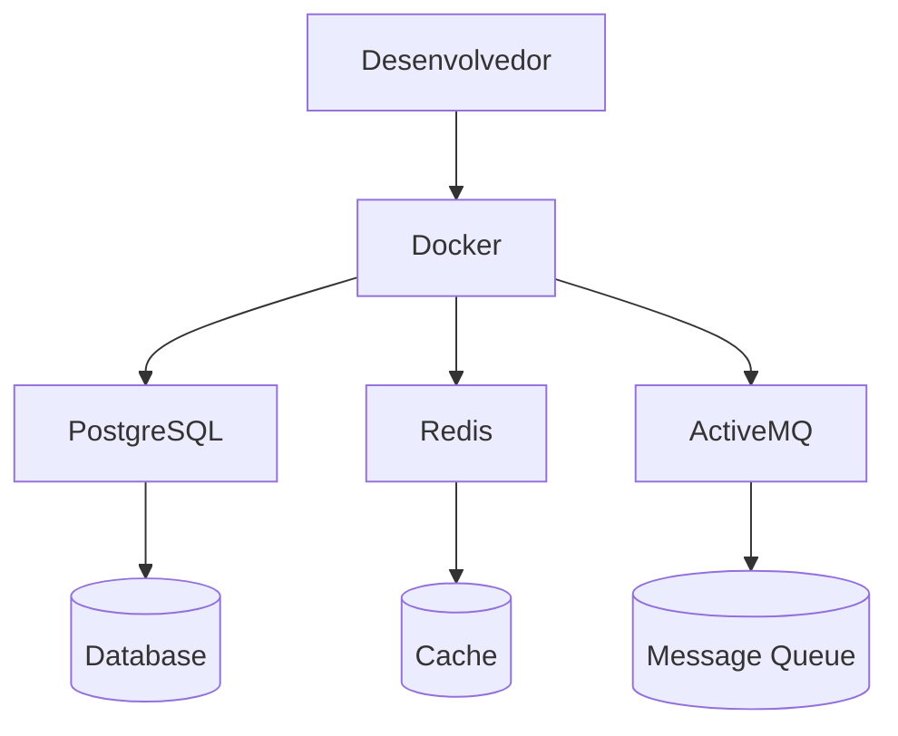

# Projeto de Integração AMI — Preparação do Ambiente

## Visão Geral

Este documento descreve o processo de preparação do ambiente de desenvolvimento para o **Projeto de Integração AMI**.

O objetivo desta etapa foi configurar um ambiente mínimo contendo os principais serviços utilizados na arquitetura do sistema, além de realizar testes básicos de funcionamento em cada um deles.

Todos os serviços foram executados utilizando **containers Docker**, com orquestração via **Docker Compose**.

---

# Arquitetura do Ambiente

O ambiente de desenvolvimento é composto pelos seguintes serviços:

| Serviço         | Tecnologia              | Função                                |
| --------------- | ----------------------- | ------------------------------------- |
| Mensageria      | Apache ActiveMQ Artemis | Comunicação assíncrona entre serviços |
| Cache           | Redis                   | Armazenamento em memória e cache      |
| Banco de dados  | PostgreSQL              | Persistência de dados                 |
| Containerização | Docker                  | Execução isolada dos serviços         |

Todos os serviços são executados localmente através do **Docker Compose**.

---

# Diagrama da Arquitetura



---

# Tecnologias Utilizadas

* Java 17
* IntelliJ IDEA
* Docker
* Docker Compose
* Spring Boot
* ActiveMQ Artemis
* Redis
* PostgreSQL

---

# Preparação do Ambiente

Inicialmente foram instalados os seguintes softwares na máquina de desenvolvimento:

* **Java 17**
* **IntelliJ IDEA**
* **Docker Desktop**

Em seguida foi criado um projeto chamado:

```
projeto-integracao-ami
```

utilizando o **Spring Initializr**.

---

# Dependências do Projeto

O projeto foi configurado com algumas dependências que podem ser utilizadas durante o desenvolvimento do sistema.

```xml
<dependencies>

    <dependency>
        <groupId>org.springframework.boot</groupId>
        <artifactId>spring-boot-starter-artemis</artifactId>
    </dependency>

    <dependency>
        <groupId>org.springframework.boot</groupId>
        <artifactId>spring-boot-starter-data-jdbc</artifactId>
    </dependency>

    <dependency>
        <groupId>org.springframework.boot</groupId>
        <artifactId>spring-boot-starter-data-jpa</artifactId>
    </dependency>

    <dependency>
        <groupId>org.springframework.boot</groupId>
        <artifactId>spring-boot-starter-data-redis-reactive</artifactId>
    </dependency>

    <dependency>
        <groupId>org.springframework.boot</groupId>
        <artifactId>spring-boot-devtools</artifactId>
        <scope>runtime</scope>
        <optional>true</optional>
    </dependency>

    <dependency>
        <groupId>org.springframework.boot</groupId>
        <artifactId>spring-boot-docker-compose</artifactId>
        <scope>runtime</scope>
        <optional>true</optional>
    </dependency>

    <dependency>
        <groupId>org.postgresql</groupId>
        <artifactId>postgresql</artifactId>
        <scope>runtime</scope>
    </dependency>

    <dependency>
        <groupId>org.projectlombok</groupId>
        <artifactId>lombok</artifactId>
        <optional>true</optional>
    </dependency>

</dependencies>
```

---

# Como Executar o Ambiente

Clone o repositório:

```bash
git clone <repositorio>
```

Entre no diretório do projeto:

```bash
cd projeto-integracao-ami
```

Suba os containers:

```bash
docker compose up -d
```

Verifique os containers em execução:

```bash
docker ps
```

---

# Serviços Disponíveis

| Serviço          | Porta |
| ---------------- | ----- |
| ActiveMQ Artemis | 8161  |
| PostgreSQL       | 5432  |
| Redis            | 6379  |

---

# Estrutura do Projeto

```
projeto-integracao-ami
│
├── compose.yaml
├── README.md
│
├── src
│   ├── main
│   └── test
│
└── docs
```

---

# Configuração do Docker Compose

Para executar os serviços foi criado um arquivo chamado **compose.yaml**.

```yaml
services:

  artemis:
    image: apache/activemq-artemis:latest
    container_name: ami-activemq
    ports:
      - "61616:61616"
      - "8161:8161"
    environment:
      ARTEMIS_USER: admin
      ARTEMIS_PASSWORD: admin

  postgres:
    image: postgres:15
    container_name: ami-postgres
    environment:
      POSTGRES_DB: ami_db
      POSTGRES_USER: admin
      POSTGRES_PASSWORD: admin
    ports:
      - "5432:5432"
    volumes:
      - postgres_data:/var/lib/postgresql/data

  redis:
    image: redis:7
    container_name: ami-redis
    ports:
      - "6379:6379"

volumes:
  postgres_data:
```

---

# Testes com PostgreSQL

Para acessar o banco de dados:

```bash
docker exec -it ami-postgres psql -U admin -d ami_db
```

## Criação de tabela

```sql
CREATE TABLE todo (
    id SERIAL,
    text TEXT,
    created_at TIMESTAMPTZ
);
```

## Inserção de dados

```sql
INSERT INTO todo VALUES
('1','Teste 1', NOW()),
('2','Teste 2', NOW());
```

## Consulta de dados

```sql
SELECT * FROM todo;
```

Resultado esperado:

```
id |  text   |          created_at
----+---------+-------------------------------
1  | Teste 1 | 2026-03-06 14:35:20.523535+00
2  | Teste 2 | 2026-03-06 14:35:20.523535+00
```

## Remoção de dados

```sql
DELETE FROM todo WHERE id = 1;
```

---

# Testes com Redis

Acesso ao Redis CLI:

```bash
docker exec -it ami-redis redis-cli
```

## Inserção de chave

```bash
SET usuario "joao"
```

## Consulta

```bash
GET usuario
```

Resultado:

```
"joao"
```

## Remoção da chave

```bash
DEL usuario
```

## Listagem de chaves

```bash
KEYS *
```

Sair do Redis CLI:

```
exit
```

---

# Benchmark de Performance do Redis

Para avaliar o desempenho do Redis foi executado:

```bash
docker exec -it ami-redis redis-benchmark -q -n 10000
```

Esse comando executa **10.000 operações simuladas** para medir a capacidade de processamento do Redis.

Exemplo de resultado:

```
PING_INLINE: 89285.71 requests per second
SET: 90090.09 requests per second
GET: 84745.77 requests per second
LPUSH: 109890.11 requests per second
LRANGE_100: 58823.53 requests per second
```

---

# Testes com ActiveMQ Artemis

Para acessar o CLI:

```bash
docker exec -it ami-activemq bin/artemis
```

## Criação de fila

```bash
queue create --user admin --password admin
```

Durante a criação são solicitadas algumas informações como:

* nome da fila
* endereço
* tipo de roteamento

---

## Verificação das filas

```bash
queue stat
```

Esse comando permite visualizar:

* quantidade de mensagens na fila
* mensagens produzidas
* mensagens consumidas

---

## Produção de mensagens

Exemplo de envio de 100 mensagens:

```bash
producer --destination address://exemplo --message "Olá" --message-count 100
```

---

## Consumo de mensagens

Consumindo uma mensagem da fila:

```bash
consumer --destination queue://exemplo --message-count 1
```

---

## Remoção da fila

```bash
queue delete --name exemplo
```

Sair do CLI:

```
exit
```

---

# Conclusão

Nesta etapa foi configurado um ambiente mínimo contendo os principais serviços utilizados na arquitetura do sistema.

Os serviços **PostgreSQL**, **Redis** e **ActiveMQ Artemis** foram executados em containers Docker e testados individualmente através de comandos básicos de criação, consulta e remoção de dados.

Com isso, o ambiente está devidamente preparado para as próximas etapas do **Projeto de Integração AMI**, que envolverão o desenvolvimento de serviços responsáveis pela comunicação entre módulos do sistema.
